# Capítulo I: Conceptos y Generalidades para una Conducción Segura

## Concepto de conducción
  Manejar un vehículo por la vía pública, conociendo el sistema vial y lo que lo conforma.

## Tipos de conductores
  - **Novato**: Conductor con licencia de primera vez y menos de tres años de experiencia.
  - **Profesional**: Persona cuya actividad laboral principal es la conducción de vehículos de transporte o quien posea licencia con acreditación profesional.
  - **No tipificado**: Conductor que renueva su licencia. Es decir, con más de 3 años de haberlo obtenida.
  - **No acreditado**: Quien no está inscrito como conductor del vehículo que utiliza.

## Cinco acciones para la movilidad segura y sostenible
  1. Infraestructura vial segura.
  2. Vehículos mas seguros.
  3. Usuarios más seguros.
  4. Mejores políticas en seguridad vial.
  5. Mejor asistencia a las victimas.

## Factores de riesgo
  * **Exposición al riesgo:** Incluye variables externas como la infraestructura vial (falta de aceras o ciclovías) y el volumen de tránsito.
  * **Posibilidad de que ocurra un accidente:** Se relaciona con fallas mecánicas, mal estado de las vías o conductas imprudentes como el consumo de alcohol y el exceso de velocidad.
  * **Gravedad de las lesiones:** Depende del diseño de la vía y de la omisión de dispositivos de seguridad como el casco o el cinturón.
  * **Evaluación de las lesiones después del accidente:** Se refiere a la eficiencia en la atención de emergencias, el traslado médico y la rehabilitación postraumática.

## ¿Qué es un accidente de tránsito?
  Acción culposa cometida por los conductores de los vehículos, sus pasajeros o los peatones.

## Tipos de accidentes
  1. **Choque de frente**: Sucede principalmente por la invasión del carril izquierdo al intentar realizar un adelantamiento.
  2. **Colisión trasera**: Ocurre por no mantener la distancia de seguridad, distracciones o exceso de velocidad que impide frenar a tiempo.
  3. **Colisión lateral**: Se produce cuando un vehículo impacta el costado derecho o izquierdo de otro durante una maniobra.

## ¿Qué es el entorno vial?
  Es el conjunto de infraestructura y elementos donde interactúan y se movilizan de forma compartida todos los usuarios: motorizados, no motorizados y peatones.

## Partes de la vía pública
  * **Vías compartidas**: Carreteras que permiten al ciclista circular con los mismos derechos y reglas que cualquier vehículo motorizado.
  * **Medianeras**: Espacios físicos que separan los carriles de sentidos opuestos.
  * **Espaldón**: Zona contigua a la calzada que brinda soporte al pavimento y sirve para el tránsito de peatones o emergencias. Sus marcas blancas mejoran la visibilidad lateral y prohíben el estacionamiento.
  * **Sistemas de contención**: Dispositivos diseñados para reducir la gravedad de las lesiones cuando un vehículo se sale de la vía.

## Tipos de vías en Costa Rica
  La red vial se clasifica en tres categorías principales según su función y ubicación:

### 1. Carreteras
  Se dividen según el volumen de tránsito y los puntos que conectan:
  * **Primarias:** Rutas de alto tránsito para viajes internacionales, interprovinciales o de larga distancia.
  * **Secundarias:** Conectan cabeceras cantonales importantes y otros centros de población (interregionales).
  * **Terciarias:** Recogen el tránsito de las rutas primarias y secundarias para viajes entre distritos de una misma región.

### 2. Calles
  * **Locales:** Vías públicas ubicadas dentro del cuadrante de un área urbana.

### 3. Caminos
  * **Vecinales:** Rutas de bajo tránsito que unen caseríos y poblaciones con la red nacional, dando acceso a fincas y unidades económicas.
  * **No clasificados:** Caminos de herradura, sendas y trillos para pocos usuarios; no se consideran calles locales ni caminos vecinales.

## Tipos de Licencia Clase B
  * **Tipo B-1**:
      * **Vehículos**: Hasta **4000 kg** de peso bruto (incluyendo remolque liviano y carga).
      * **Extras**: Autoriza UTVs, y en carreteras no primarias, triciclos y cuadriciclos de hasta **550 cc**.
  * **Tipo B-2**:
      * **Vehículos**: Hasta **8000 kg** de peso bruto (incluyendo remolque y carga).
      * **Requisitos**: Mayor de **20 años** y tener licencia clase B o C con al menos **2 años** de expedida.
  * **Tipo B-3**:
      * **Vehículos**: Todo peso, **excepto** vehículos pesados articulados.
      * **Requisitos**: Mayor de **22 años** y tener licencia clase B o C con al menos **3 años** de expedida.
  * **Tipo B-4**:
      * **Vehículos**: Todo peso, **incluyendo** vehículos pesados articulados.
      * **Requisitos**: Mayor de **22 años** y tener licencia clase B o C con al menos **3 años** de expedida.

## Modalidades de Licencia, otros vehículos
  * **Clase A**: Bicimotos, motocicletas, triciclos y cuadriciclos.
  * **Clase C**: Transporte público (taxis, microbuses, busetas y autobuses).
  * **Clase D**: Tractores de llantas o de oruga y otros tipos de equipo especial.
  * **Clase E**: Vehículos de dos o más ejes, **excepto** los destinados al transporte público.

## 1. Acumulación de Puntos
  Es un mecanismo de control de infracciones para fomentar la seguridad vial. Permite **descontar la mitad de los puntos** acumulados mediante trabajo comunitario o cursos de reeducación vial.
  El límite de puntos depende del periodo de vigencia de la licencia:
  * **Vigencia de 6 años**: Máximo **12 puntos**.
  * **Vigencia de 4 años**: Máximo **8 puntos**.
  * **Vigencia de 3 años**: Máximo **6 puntos**.

## 2. Suspensión de la Licencia de Conducción
  La pérdida de la totalidad de los puntos invalida todas las licencias del conductor. Los plazos y condiciones son:
  * **Primera vez:** Suspensión por **12 meses**. 
      * Puede reducirse a **6 meses** si se demuestra dependencia laboral de la conducción o mediante trabajo comunitario ante el COSEVI.
  * **Segunda vez:** Suspensión por **24 meses** (sin opción de reducción por dependencia laboral).

  **Requisitos para la reacreditación:**
    1.  Curso de sensibilización y reeducación vial.
    2.  Programa de tratamiento de adicciones (si aplica).
    3.  Programa de control de conductas violentas y tratamiento psicológico (si aplica).

## 3. Restricción por puntos acumulados
  Quien acumule **5 puntos o más** (sin llegar al límite de suspensión) enfrentará una restricción al renovar su licencia. Para realizar la renovación, el conductor deberá cumplir obligatoriamente con una de estas dos opciones:
  * Realizar **trabajo comunal**.
  * Aprobar un **curso de reeducación vial**.
  El sistema de puntos actúa como un requisito previo para habilitar el trámite de renovación en caso de acumulación parcial.

## Documentos necesarios para circular
  * **Licencia de Conducir:** Debe estar vigente, en buen estado y corresponder a la categoría del vehículo que se maneja.
  * **Documento de Identidad:** Cédula de identidad para nacionales, o DIMEX/Pasaporte vigente para extranjeros.

### Documentos del Vehículo
  * **Derecho de Circulación (Marchamo):** Comprobante de pago anual que incluye el seguro obligatorio (SOA). Debe portarse el documento físico y tener el **sticker (marchamo)** pegado en el parabrisas.
  * **Inspección Técnica Vehicular (IVE):** El certificado de la revisión técnica vigente y el **sticker** correspondiente en el parabrisas.
  * **Título de Propiedad:** Se recomienda portar el original o una certificación del Registro Nacional (con menos de un año de emitida).
  * **Placas de Matrícula:** El vehículo debe portar ambas placas (delantera y trasera) en los lugares reglamentarios y de forma visible.

## Colores de luces para vehículos de emergencia
  * **Rojo:** Servicios de salud (ambulancias).
  * **Amarillo/Ámbar:** Atención de emergencias y servicios de asistencia.
  * **Azul:** Servicios policiales.

## Prioridad de paso en las vías
  1.  **Vehículos sobre rieles:** El tren siempre tiene la prioridad absoluta.
  2.  **Autoridades:** Inspectores regulando el tránsito.
  3.  **Vehículos de emergencia:** Aquellos autorizados con sirenas y luces.
  4.  **Jerarquía de vías:** Primaria tiene prioridad sobre secundaria, y secundaria sobre terciaria.
  5.  **Intersecciones sin señales:** El vehículo que aparece por la **derecha** tiene la prioridad.
  6.  **Semáforo vs. Alto:** El semáforo prevalece sobre la señal de "Alto".
  7.  **Ceda vs. Alto:** El "Ceda" tiene prioridad sobre el "Alto".
  8.  **Giro a la izquierda:** Quien gira a la izquierda debe ceder el paso a quienes circulan directo por la vía principal o accesos secundarios.
  9.  **Sentido directo:** Los vehículos que continúan directo tienen prioridad sobre los que giran desde el mismo acceso.

## Tipos de carriles y su utilización
  * **Carril derecho**: Destinado al **tránsito lento**. Siempre se debe circular por este, dejando el izquierdo para adelantar.
  * **Carril izquierdo**: Se utiliza para **adelantar** en vías de un mismo sentido, o es el de sentido contrario en vías de doble sentido. Si un vehículo rápido se aproxima por detrás, debe pasarse al carril derecho.
  * **Carril de tránsito lento**: Carril derecho específico para vehículos pesados (camiones o buses) o de menor velocidad para no obstaculizar el tráfico.
  * **Carril de ascenso**: Exclusivo para vehículos lentos en carreteras de **montaña o pendientes**, permitiendo que los vehículos rápidos adelanten por la izquierda.
  * **Carril exclusivo para buses**: Uso restringido para autobuses en horarios específicos. Para girar a la derecha, los conductores particulares deben ingresar a la **zona mixta** (flecha de doble cabeza) en los últimos 50 metros.
  * **Carril reversible**: Vías donde el sentido de circulación cambia según horarios. Se regula mediante señales verticales y **semáforos de dos luces** (verde/roja).
  * **Carril compartido (Vías 30 km/h)**: Zonas pacificadas diseñadas para la convivencia de vehículos, ciclistas y peatones. La velocidad máxima es de **30 km/h** para proteger a los usuarios más vulnerables.

## Normas de circulación y Entorno Vial

### 1. Velocidad según carriles
  * **Diferenciación:** En carreteras de varios carriles, el carril **derecho (externo)** tiene una velocidad menor que el **izquierdo (interno)**. 
      * *Ejemplo:* En la General Cañas, el externo es de 60 km/h y el interno de 80 km/h.
  * **Sanción:** Exceder los 100 km/h en el carril derecho conlleva multa y acumulación de puntos.

### 2. Espaldón (Arcén)
  * **Función:** Soporte lateral, paso peatonal, zona de emergencias y estacionamiento eventual.
  * **Prohibición:** Está **prohibido circular o adelantar** por el espaldón (incluyendo motociclistas), excepto en emergencias o por indicación de una autoridad.

### 3. Cambios en el sentido de circulación
  * **Permanentes o temporales:** Las autoridades pueden cambiar el sentido de las vías. Es responsabilidad del conductor estar atento a la señalización (vertical y horizontal) para evitar circular en contravía.

### 4. Cambios temporales y desvíos
  * **Causas:** Eventos festivos, trabajos en la vía o situaciones especiales.
  * **Señalización:** Se utilizan conos, barreras y la guía de la Policía de Tránsito. Estos cambios suelen ser de corta duración (pocas horas).

# Capítulo II: Señalamiento Vial

## ¿Qué son las señales de tránsito?
  Normas que ordenan el espacio vial, garantizando el desplazamiento seguro para los conductores, pasajeros y peatones.

## Tipos de señales de tránsito
  En el sistema vial encontraremos diferentes tipos de señales de tránsito: verticales, horizontales, luminosas, sonoras y manuales.

### Señales verticales
  Su función es informar, regular o prevenir a los usuarios.
  Consisten en un poste metálico con una placa en su parte superior. Las placas están hechas con un material retrorreflectivo para facilitar su visibilidad durante la noche.
  Estas señales se agrupan según sus funciones particulares:

#### 1. Señales de reglamentación
  Indican obligaciones, prohibiciones o normativas. En su mayoría de forma rectangular, fondo blanco, con símbolos, letras de color negro y círculo rojo que rodeo el símbolo.

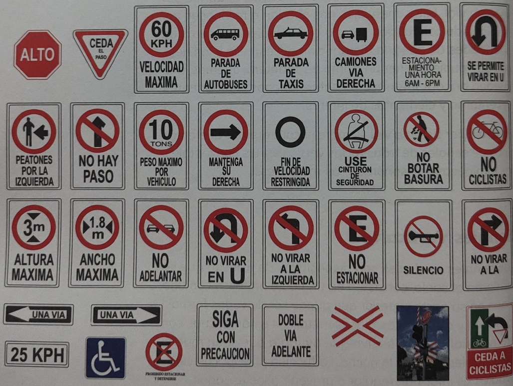

#### 2. Señales de prevención
  Estas señales cumplen la función de advertir sobre peligros u obstáculos reales o potenciales en la vía. Se caracterizan generalmente por su forma cuadrada con fondo amarillo y símbolos negros, aunque cambian a un fondo naranja y una ubicación temporal cuando se utilizan específicamente para alertar sobre zonas de obras.

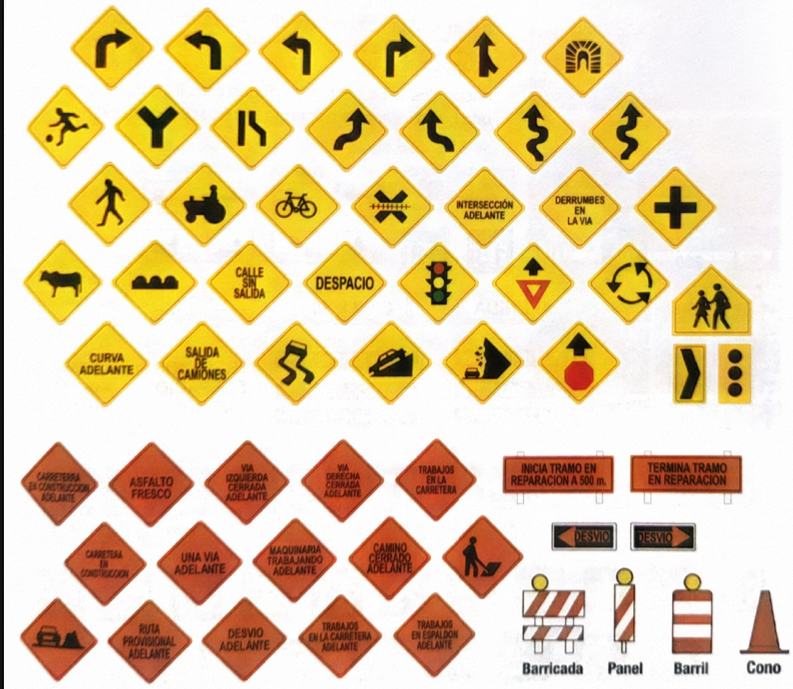

#### 3. Señales de información
  Su propósito es orientar y facilitar información útil al usuario para que transite de forma segura y directa. Sus características varían según el entorno: en carreteras principales son grandes con fondo verde y letras blancas, mientras que en rutas secundarias suelen tener fondo blanco con detalles en negro. Asimismo, las señales de servicio y turismo utilizan fondo azul, las de áreas silvestres o parques nacionales son café, y cualquier señal informativa que incluya una barra roja inclinada indica una prohibición.

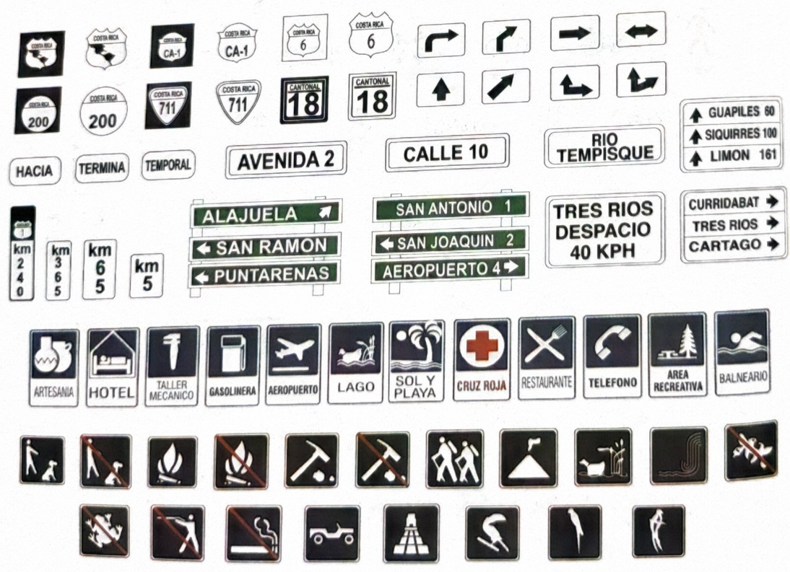

### Señales horizontales
  Marca de pintura de color amarillo o blanco sobre la superficie de rodamiento. En algunos casos se utiliza para complementar las órdenes de otras señales.
  **Amarillo** indica la separación de carriles en sentidos opuestos. En bordees de acera y paradas de autobús implica prohibición de estacionamiento.
  **Blanco**: separa los carriles de un mismo sentido. Se usa en línea de parada, velocidad máxima, flechas direccionales y zonas seguras.
  **Azul**: complementa señales informativas, como estacionamiento para personas con discapacidad y carriles exclusivos.
  **Verde**: Señalizar espacios de la vía compartidos con ciclistas.

#### Demarcaciones más frecuentes sobre la vía
  - **Línea de centro**: Ordena el tránsito en sentidos diferentes. Es de color amarillo. En línea continua no se adelanta.
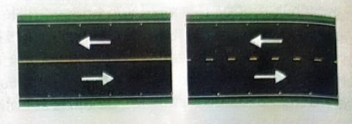

  - **Línea de barrera**: Utilizada en lugares donde no se permite adelantar. Se demarca con una línea continua camarilla junto con otra ya sea continua o discontinua. Se complementa con **captaluces amarillos**.
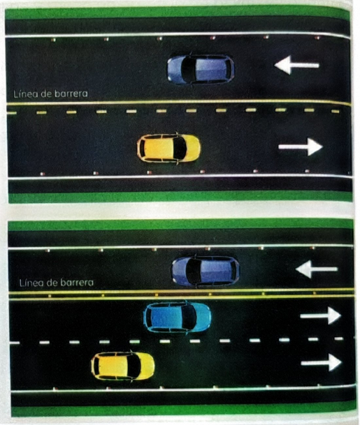

  - **Línea de carril o línea de vía**: Ordena carriles en el mismo sentido. Demarcada de color blanco. Continua o discontinua. Se complementa con **captaluces blancos**.
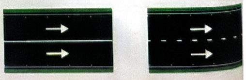

  - **Línea de borde**: Separa la calzada con el espaldón o el caño. Guía al conductor a no salir de la calzada. Es continua de color blanco. Usa **captaluces rojos o blancos**.
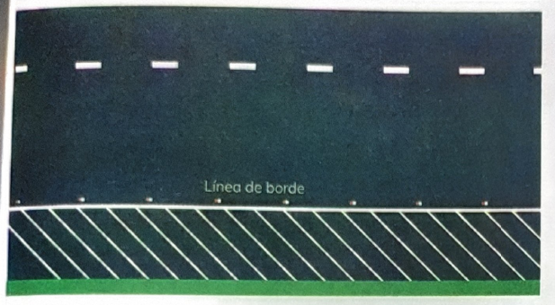

  - **Línea de canalización**: Guía a vehículos que desean virar a la izquierda. Línea blanca continua.
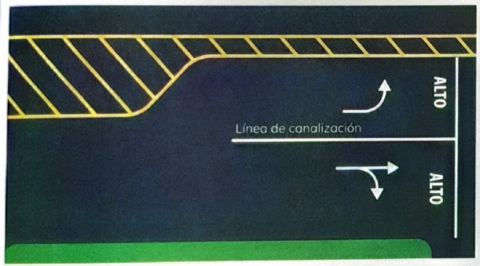

  - **Isla de canalización**: Ordena el tránsito en zonas conflictivas. Elimina el sobreancho de la calzada. Su color depende del sentido de circulación: blanco o amarillo.
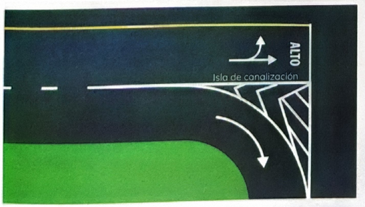

  - **Carril reversible**: Regulado por horarios y por semáforo. Se demarca en la franja central de la carretera.
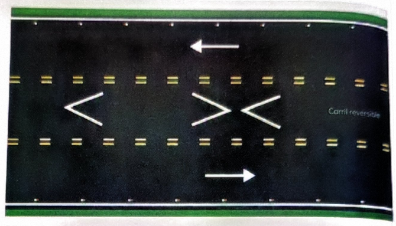

  - **Cajón o caja amarilla**: Prohibición de bloqueo en intersecciones.
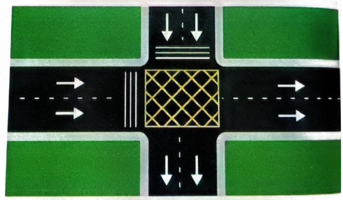

### Señales luminosas
  Mediante luces, brinda información importante.

  - **Semáforo vehicular**: Rojo indica al conductor que debe detenerse; Amarillo indica avisa camio a luz roja para disminuir velocidad; verde indica al conductor que puede continuar.
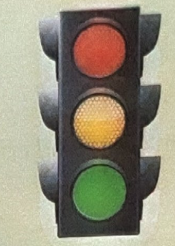

  - **Señal luminosa transitoria**: informa sobre situaciones temporales previniendo el riesgo.
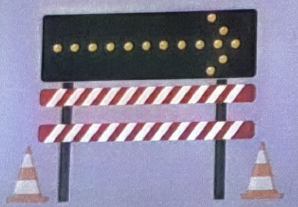

  - **Semáforo peatonal**: cuenta con dos luces: roja indica no pasar; verde indica que puede cruzar.
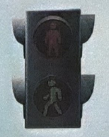

### Señalamiento sonoro
  Advierten de situaciones de peligro.
  - Sirenas de vehículos de emergencia.
  - Pitoreta del tren.
  - Pito de los vehículos.
  - Pito del oficial de tránsito.
  - Algunos semáforos peatonales.

### Señalamiento manual
  Indicaciones de los oficiales de tránsito con sus manos. Ciclistas al indicar sus maniobras.

## Las velocidades
  - En autopista, la velocidad mínima será de 50km/h.
  - Sin demarcación, el límite máximo será 60km/h. En zona rural de alta densidad poblacional, será de 50km/h.
  - En pasos peatonales localizadas alrededor de planteles educativos con estudiantes presentes y centros de salud, el límite será de 25km/h

# Capítulo III: Vehículos Seguros: Características y Elementos de Seguridad del Vehículo

## Panel de control o Panel de instrumentos
  Pantalla ubicada frente al conductor que muestra la velocidad, revoluciones del motor y temperatura, entro otros. Permite ver la información necesaria para conducir de forma segura, sin desviar la mirada de la carretera por mucho tiempo.

### Colores de los símbolos
  - **Rojo**: Atender de inmediato. Ej: Puerta abierta.
  - **Verde**: Sobre aspectos informativos. Ej: Direccionales.
  - **Amarillo (ámbar)**: Atienda al detenerse. Ej: Check engine (motor)

### Funcionamiento del vehículo
  - **Tacómetro**: Mide la velocidad de rotación del motor en revoluciones por minuto (RPM).
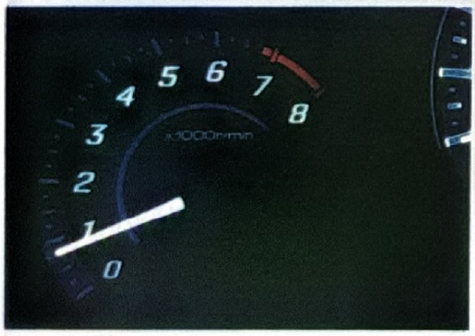

  - **Nivel de combustible**: Cuando el nivel es bajo, se enciende una luz ámbar.
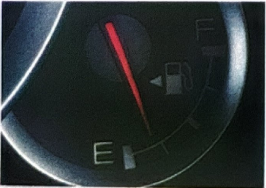

  - **Temperatura del motor**: Después del arranque, debe estar cerca de la parte baja (letra C) y conforme se empieza a conducir, el indicador irá subiendo hasta ubicarse en el centro de la escala. Si este continua subiendo, podría ser un indicador de que ocurre un problema. Cerca de la letra H, se debe detener el vehículo de inmediato y llevar a revisión.
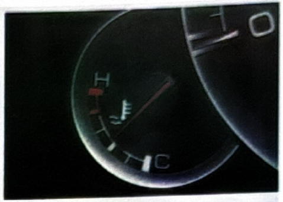

  - **Estado de la batería**: Este símbolo muestra si el alternador está cargando la batería. No indica si la batería está en mal estado.
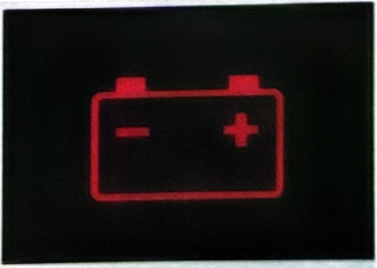

### Indicadores para la conducción en carretera
  - **Indicador de velocidad**: Muestra la velocidad del vehículo en km/h. Según Ley 9078, todos los vehículo deben este indicador en km/h.
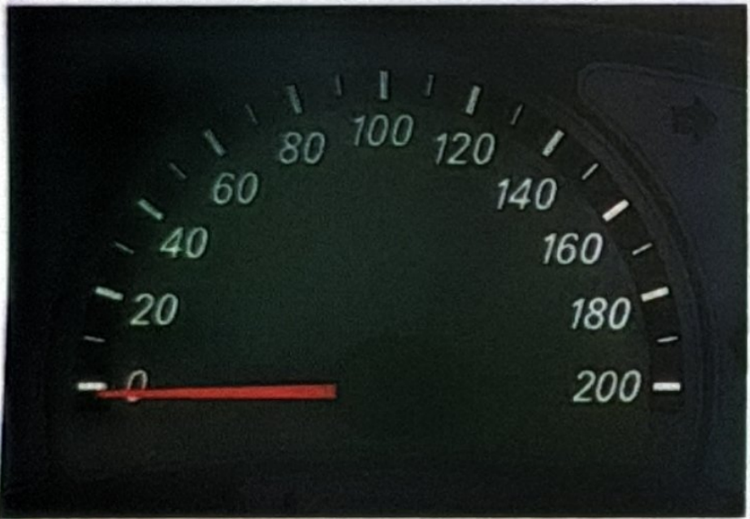

  - **Indicador de distancia recorrida (odómetro)**: Odómetro o cuentakilómetros, mide la distancia recorrida por el automóvil.
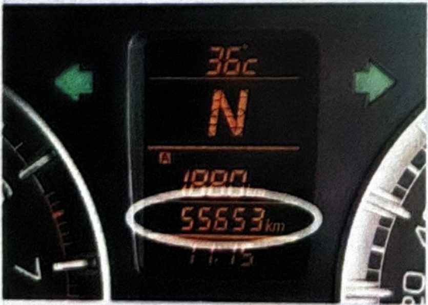

### Palanca de cambios en vehículos automáticos
Indica el modo de desplazamiento, como lo siguiente:
  - **P**: Estacionar y sacar la llave de ignición.
  - **R**: Mover el vehículo en reversa.
  - **D**: Para avanzar.
  - **L1**: Confeccionada para ofrecer mayor potencia al motor. Para enfrentar pendientes tanto en ascenso como en descenso.
  - **S (modo deportivo)**: Para carreteras con muchas curvas.
  - **L2**: Ofrece mayor potencia. Utilizada en pendientes menos pronunciadas.

### Señales de alarma
  - **Nivel de aceite bajo**: Señala cuando el aceite del cárter está por debajo de lo normal.
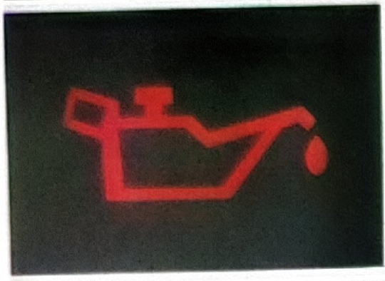

  - **Presión de aceite**: Se muestra en un manómetro. Se encuentra especialmente en vehículos de carga liviana, algunos otros no lo tienen.
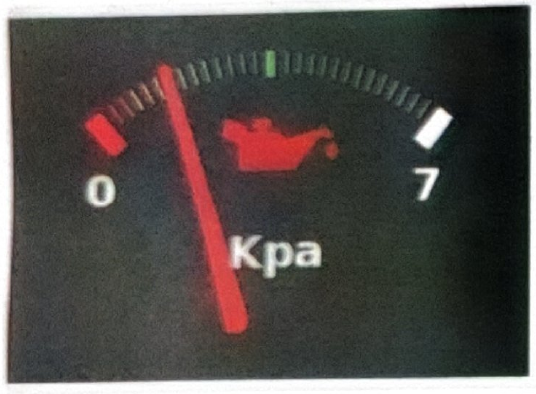

  - **Temperatura alta del motor**: Si el motor se sobrecalienta, es importante deteneser de inmediato.
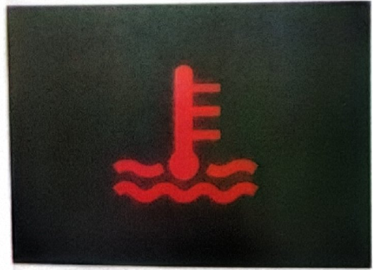

  - **Revistar motor (check engine)**:
    - **Luz intermitente**: una falla que se arregló (se puede revisar con scanner posteriormente).
    - **Luz permanente**: falla relacionada con rendimiento, afecta consumo de combustible.
    - **Luz parpadeante**: atender de inmediato, puede agravarse y perjudicar otros aspectos del vehículo.
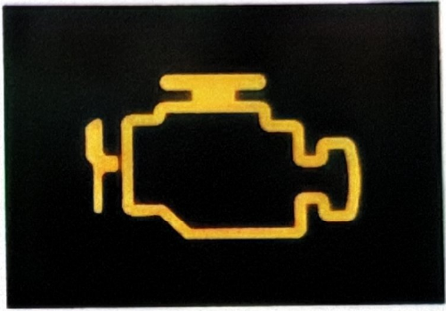

  - **Funcionamiento del ABS**: se activa cuando uno o varios sensores del sistema no funcionan correctamente. Se debe realizar mantenimiento correctivo lo antes posible.
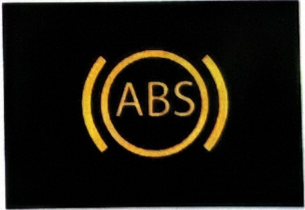

## Espejos retrovisores y su uso

### Espejo central
- Uso correcto: visualizar el entorno trasero a través de la ventana trasera.
  - Permite ver lo que hay detrás del vehículo.
  - Ayuda en maniobras de reversa y conducción activa.
  - Ubicado en la parte superior de la cabina, centrado entra las viseras o parabrisas.
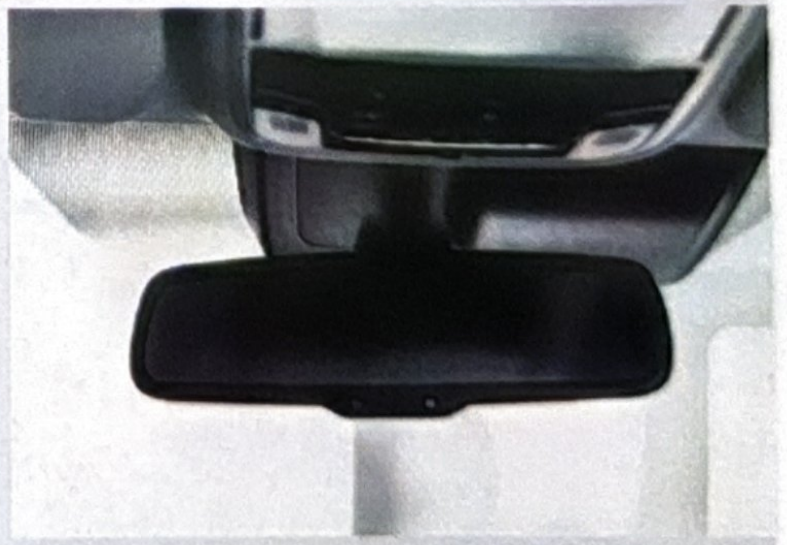

### Espejos laterales
  - Proporcionan visibilidad hacia atrás y una amplia perspectiva de los lados del vehículo.
  - Ayuda en maniobras de adelantamiento, reversa y en la entrada/salida de vías.
  - Se recomienda ajustar para ver solo la manija de la puerta trasera.
  - No ver la manija de la puerta trasera indica un ángulo de visión muy abierto, generando un punto ciego.
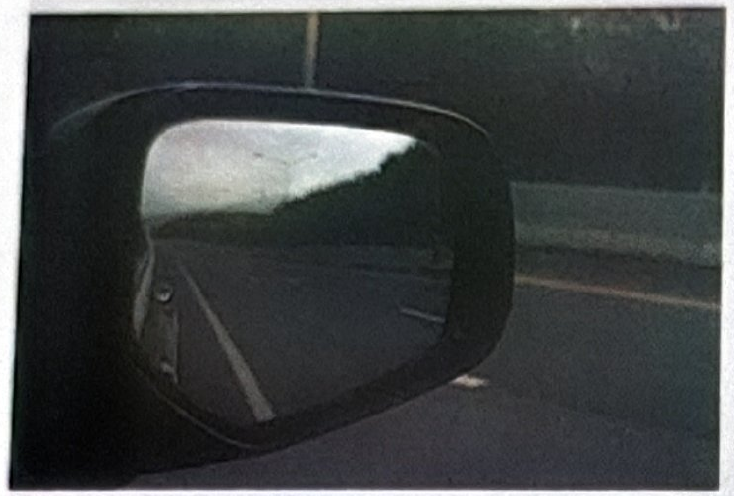

### Espejos de ojo de pescado
  - Permiten una visión panorámica ampliada.
  - Detectan maniobras de otros conductores antes de ser visibles en el espejo lateral principal.
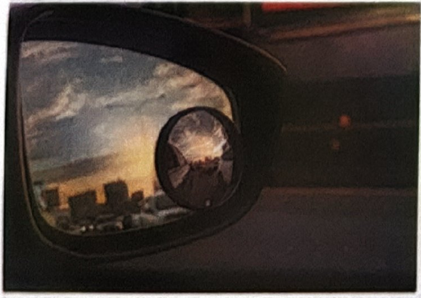

## Luces para ver y su uso correcto

### Luz alta (larga)
  - Se cuenta con dos o cuatro.
  - Proyectan luz hasta a 100m.
  - Usar con precaución para no deslumbrar a otros.
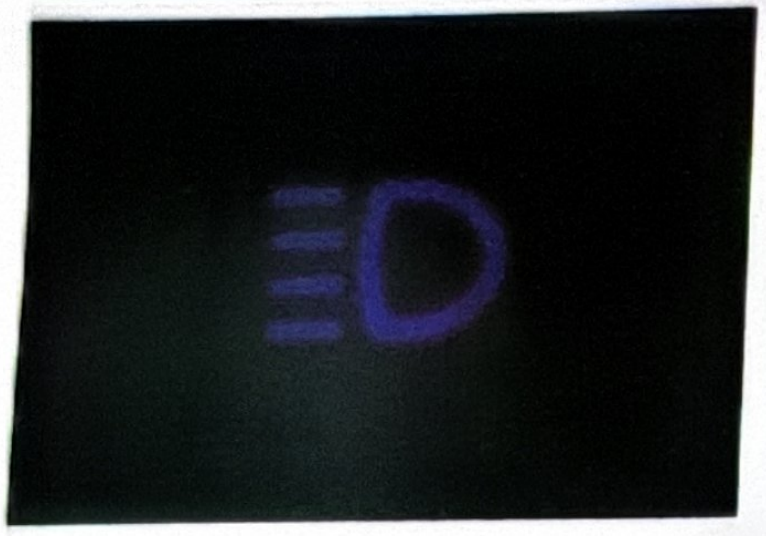

### Luz baja (corta)
  - Se cuenta con dos luces.
  - Permite ver hasta 30m.
  - Uso obligatorio entre las 6:00 p.m. y las 6:00 a.m. o en condiciones de poca visibilidad.
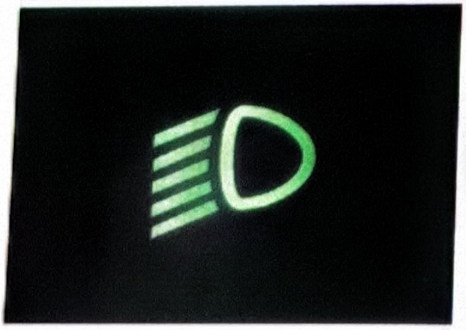

### Luz antiniebla (halógenos)
  - Se cuenta con dos o cuatro luces antiniebla blancas o amarillas.
  - Uso permitido solo en condiciones climáticas adversas.
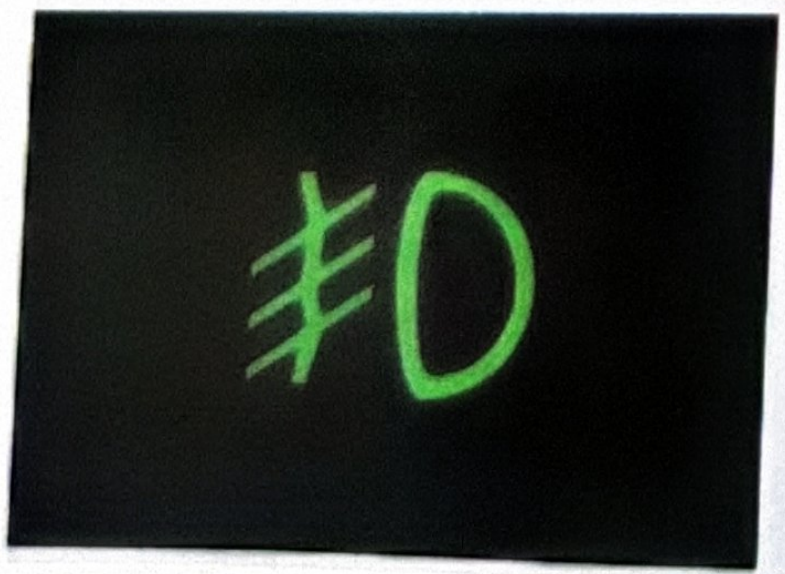

## Luces para ser vistos y su uso correcto

### Luces de posición
  - Se encienden con la luz alta, baja o antiniebla.
  - Indican el ancho y la posición del vehículo desde 150m
  - Son blancas o amarillas adelante y rojas atrás.
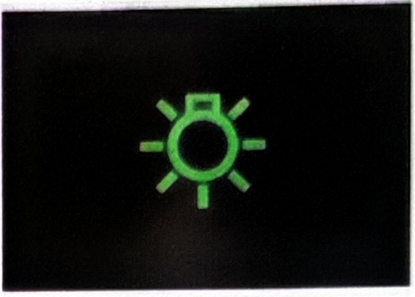

### Dispositivos catadióptricos (reflectivos)
  - Reflejan la luz para hacer visible el vehículo cuando está apagado.
  - Son de color rojo, ubicados en la parte trasera.
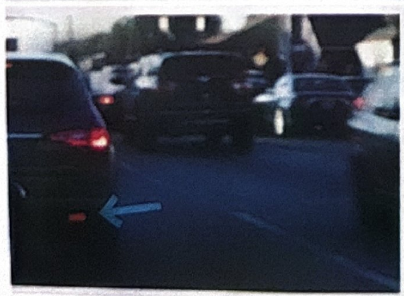

### Luz de circulación diurna
  - Mejora la visibilidad del vehículo durante el día.
  - Reduce el riesgo de accidentes en un 5%.
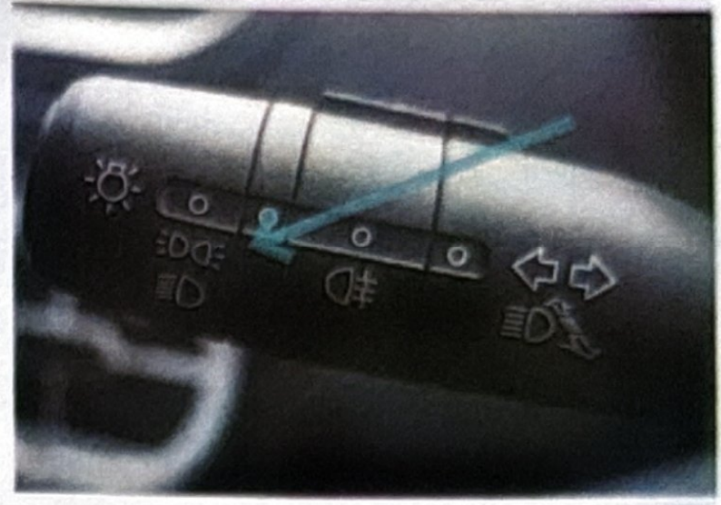

## Los frenos y su importancia

### Freno de tambor
  - Sus componentes están dentro de un tambor que gira con el eje de las ruedas.
  - Al accionar el pedal, las zapatas presionan contra el tambor, generando fricción y deteniendo el vehículo.
  - Tienen menor ventilación, por lo que son más propensos a calentarse y perder efectividad.

### Freno de disco
  - Opera por fricción entre las pastillas de frenado y un disco.
  - El disco está expuesto al aire, lo que permite mejor ventilación.
  - Menos propensos a fatiga por altas temperaturas.
  - Más comunes en el eje delantero y preferidos por su mejor rendimiento.

### Sistema ABS
  - Su sistema antibloqueo mejor la seguridad activa del vehículo.
  - Permite frenar y cambiar de trayectoria.
  - Frenado suave y evita el derrape.

# Capítulo IV: Conducción y Maniobras Seguras en Carretera

## Previo al abordaje y la preparación del viaje

### Asiento del conductor
  Al menos 20 cm entre su pecho y el volante.

### Apoyacabezas
  Alinear la parte central a la altura de sus orejas.

### Cinturón de seguridad
  El cinturón absorbe la mayor parte de las fuerzas que recibe el cuerpo en caso de un choque.
  - **En mujeres embarazadas**: colocar la banda horizontal sobre la pelvis y la diagonal sobre el hombro, pasando entre los senos.

### Sujeción del volante
  Mantener ambas manos en el volante en la posición "diez horas con diez minutos" (10:10).

## La conducción en la via

### Adelantar motocicletas o bicicletas
  Deje espacio lateral mínima de 1.50 metros

### Vehículo en sentido contrario adelantando
  Si ve un vehículo en sentido contrario que está adelantando debe:
  - Disminuir la velocidad.
  - Hacer cambio de luces.
  - Orillarse hacia el espaldón de la vía.
  - Detenerse de ser necesario.

## Maniobra marcha atrás (reverva)

### Pasos
  - Encienda las luces antes de iniciar la maniobra.
  - Use los retrovisores siempre.
  - Mantenga una velocidad baja, no más de 20 km/h.
  - La reversa debe ser siempre en línea recta.

> [!NOTE]
> La marcha atrás solo está permitida en tramos cortos, no mayores a 50 metros. La infracción a esta regla conlleva una multa categoría D

## Frenado seguro

### Eficacia del frenado
  Capacidad que tiene el sistema de freno para responder de manera adecuada a la acción de frenar. Se mide en la distancia que necesita un vehículo para detenerse de acuerdo a su velocidad y peso.

## Intersecciones
  Siempre tiene prioridad la persona que circula por la vía principal, pero debe prestar atención a las señales.

### Tipos de intersecciones
  - **A nivel**: pueden tener señales o semáforos.
  - **Elevadas**: un camino pasa por encima o debajo del otro.
  - **Con rotondas**: el tránsito circula en un círculo alrededor de una isla central.

#### Intersecciones no señalizadas
  Quien tiene prioridad, debe seguir la regla de la ley de tránsito. Esta regla dice que el vehículo a su derecha tiene el paso.

> [!NOTE]
> Giro a la derecha tiene prioridad uno.

### Rotondas
  - Velocidad máxima: 30 km/h
  - Indicar intención de ingresar con direccional izquierdo. Si abandona en la primer salida, utilizar direccional derecho
  - Mantenga el direccional izquierdo en la rotonda y cambie al derecho solo para salir.
  - Se prohíbe cambiar de carril dentro.
  - No se puede adelantar.
  - Use el carril derecho (externo) si abandona en la primera o segunda salida.
  - Use el carril izquierdo (interno) si abandona en la segunda salida o posteriores.

## Circulación por puentes y túneles
  - En túneles, siempre debe llevar las luces encendidas, y circular a máximo de 30 km/h.
  - Si tiene una emergencia, coloque los triángulos preventivos al menos 90 metros detrás del vehículo.

## Conducción nocturna

### Consejos
  - La luz alta debe cambiarse por la corta 150m antes de cruzarse con otro vehículo o antes de una curva.
  - Las luces deben ser visibles a 250m de distancia.

## Conducción en carreteras de velocidad (autopistas)

### Recomendaciones
  - Si ingresa desde una calle lateral, deténgase con la señal de alto o ceda. Si no hay señal, actué como si hubiera una señal de alto.
  - Una vez en la autopista, acelere rápidamente hasta alcanzar la velocidad máxima permitida.
  - Manténgase en el carril derecho hasta alcanzar la velocidad máxima.

## Puestos de control o de Peje

### Peajes
  - Disminuya la velocidad hasta un máximo de 30 km/h
  - Observe el señalamiento luminoso o vertical para ubicarse en el carril correcto.

### Puestos de control policial
  - Si le piden detenerse, encienda las luces de emergencia y tenga a mano toda la documentación necesaria del vehículo y la suya.

## Velocidades Máximas y Mínimas

### Velocidad Máxima permitida en autopistas
  - En las carreteras de velocidad, esta varía entre 80 y 100  km/h

### Velocidad mínima permitida
  - En autopista, es de 50 km/h
  - En algunas carreteras puede estar señalizada a 40 km/h

# Capítulo V
